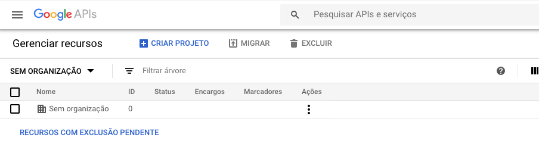
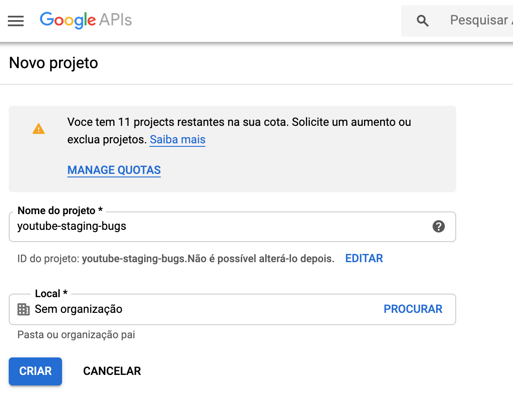
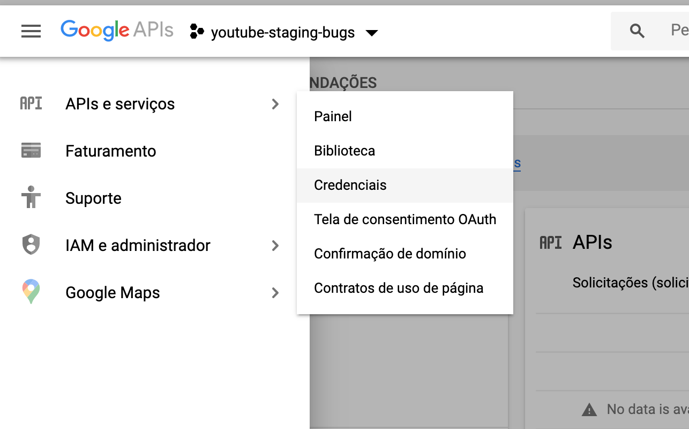
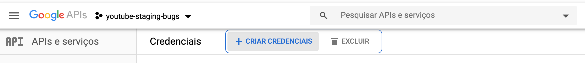
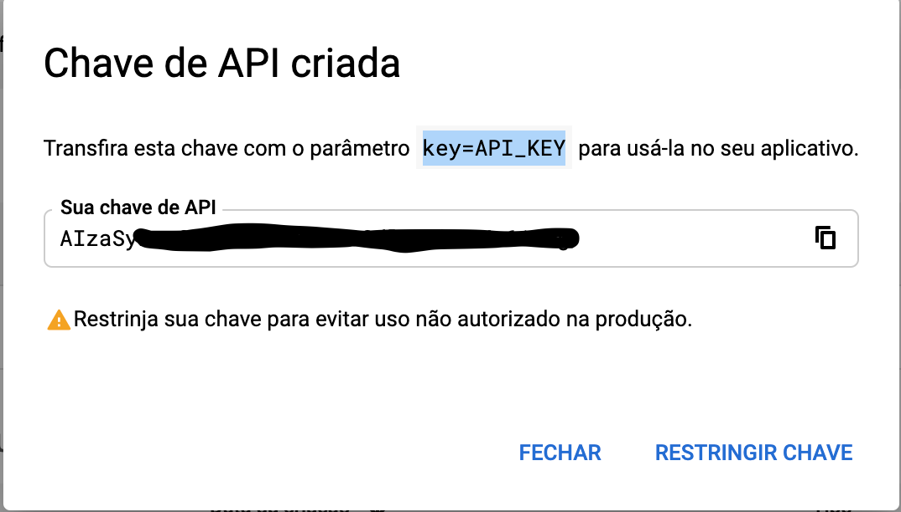
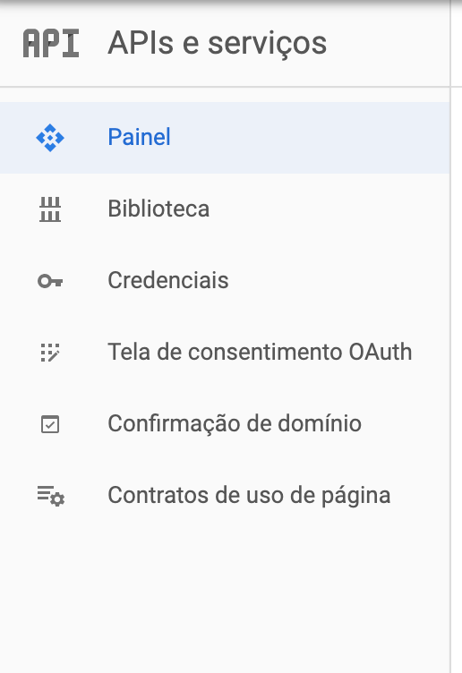
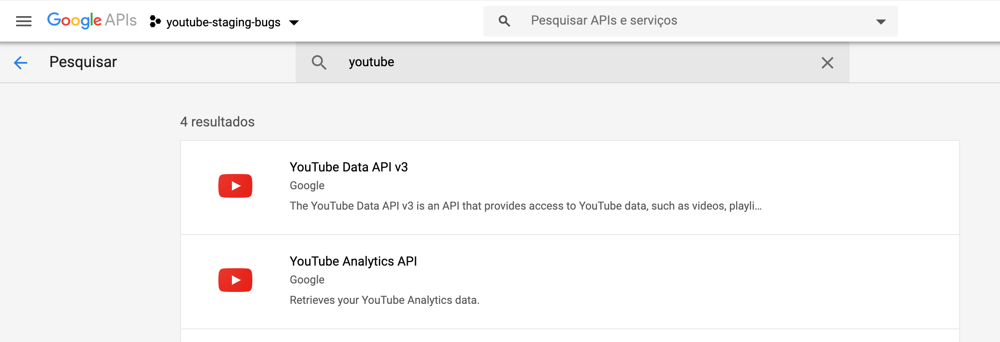
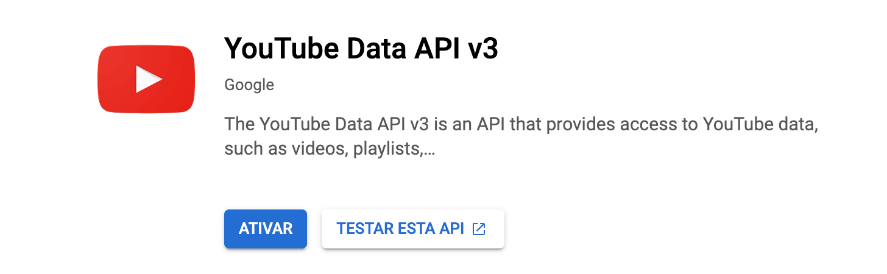
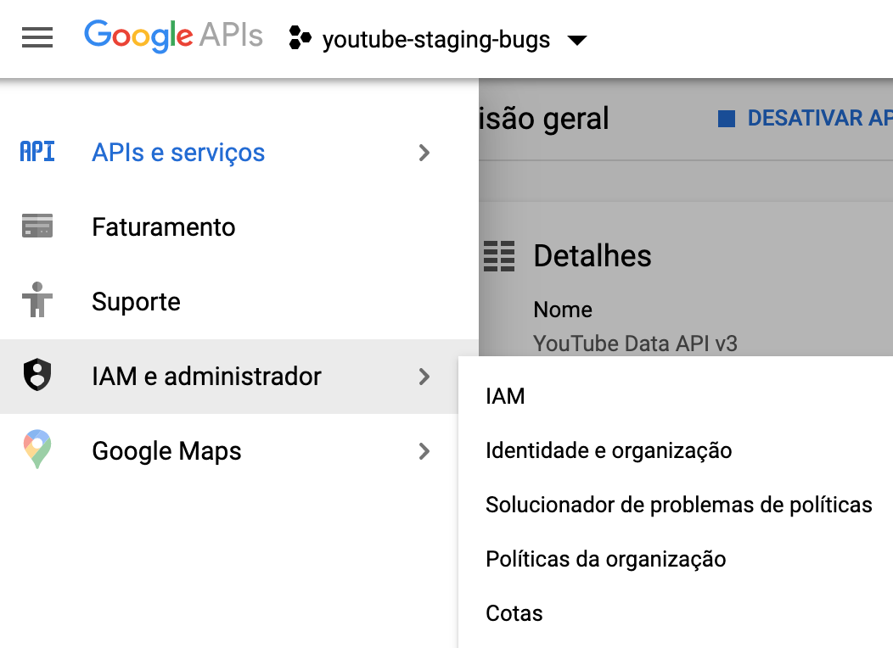

## 🗒 Youtube API Key

Para ter acesso à `API` do youtube, enquanto desenvolve a aplicação, você precisará de uma **chave de acesso**. Essa chave (_key_) de acesso permite que você faça requisições para consultar vídeos e dados disponibilizados pela API do youtube. Contudo, cada `key` tem um limite de requisições. Devido ao limite de requisições, utilize-as **com sabedoria**.

A seguir você encontrará um passo a passo de como criar a chave de acesso à API.

### Caso queira consultar a documentação sobre a API
- [Youtube API](https://developers.google.com/youtube/v3/docs)

### Para criar sua key
- Acesse o [Google Developers Console](https://console.developers.google.com/cloud-resource-manager).

- Após acessar o **Google Developers Console**, clique em `CRIAR PROJETO`.
 
    

- Em seguida, dê o nome ao seu projeto de `"youtube-staging-bugs"` e clique em **CRIAR**.

    

- Agora, vamos criar nossa key. Acesse **"APIs e serviços" -> "Credenciais"** pelo menu lateral.

    

- Clique em **"CRIAR CREDENCIAIS"**.

    

- Pronto! Sua key de acesso à API está criada!

    

---

### Agora temos que habilitar o acesso dessa chave!

- Acesse pelo menu lateral a tela de **"Bibliotecas"**.

    

- Busque pelo serviço: `"YouTube Data API v3"`, o qual vamos utilizar!

    

- Clique em `"Ativar"` e pronto, sua key já tem acesso 🚀

    

- Para acessar o limite de requisições basta acessar **"IAM e Admin" -> "Cotas"**

    

---